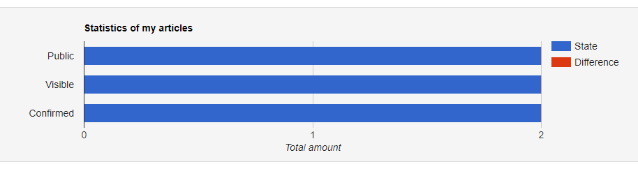

Articles Overview Plugin
########################

Graph showing the status of your own articles.

.. contents::

Preview
*******

Requirements
************

- PHP 5.3+
- SunLight CMS 8

Installation
************

#. Copy the folder ``plugin`` and its contents to the root directory or through system administration ``Administration > Plugins > Upload new plugins``

Extend Events
*************

``aos.stats.columns``
---------------------

Allows you to add more columns to the statistics report.

Params:

- ``name`` - column name
- ``value`` - (optional) the expected value to add to the statistics, ``default: 1``
- ``label`` - label in the overview

Example:

.. code:: php

    <?php
	
    Extend::reg('aos.stats.columns', function($args) {
        $args['columns'][] = [
            'name' => 'notified',
            'value' => 0,
            'label' => 'Notified',
        ];
    }